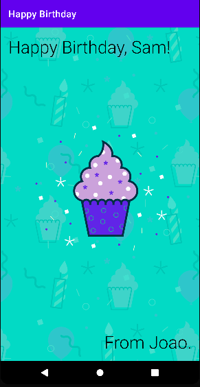

<h1 style="text-align: center;">
Projects developed from Android Basics in Kotlin
</h1>

<h2 style="text-align: center;">
    Birthday Card app
</h2>

    

<h2 style="text-align: center;">
    Dice Roller App
</h2>

 
Displaying the appropriate sided dice for the number of side that was rolled by clicking in the button "ROLL".

    

